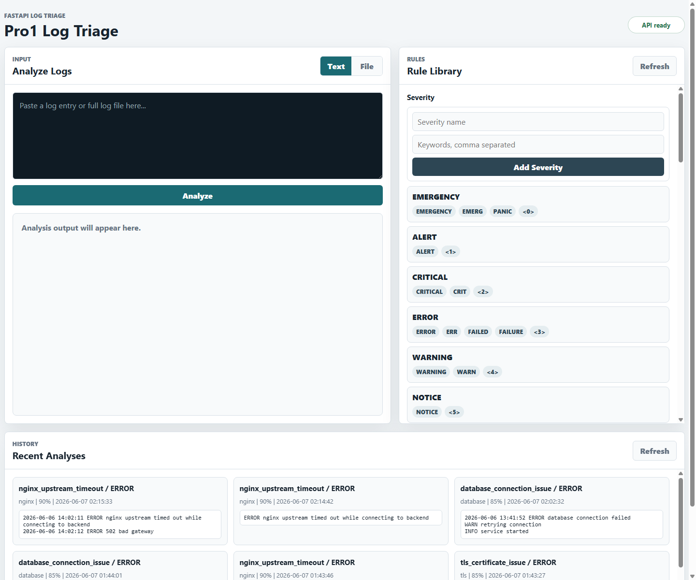

# Pro1 Log Triage

Pro1 Log Triage is a small FastAPI web app for quickly testing log triage rules. Paste log text or upload a log file, run the analyzer, and the app returns the detected severity, component, triage category, confidence, suggested action, commands to check, and recent analysis history.



## What It Does

- Accepts logs as pasted text or uploaded `.log` / `.txt` files.
- Parses basic log details such as line count, timestamp, severity, and component.
- Applies triage rules to classify the likely issue.
- Stores analysis results in SQLite so recent runs appear at the bottom of the dashboard.
- Lets you add severity, component, and triage rules from the website.
- Runs locally with Python or inside Docker Compose.

## Quick Start

Run with Docker Compose:

```powershell
docker compose up --build
```

Open the website:

```text
http://127.0.0.1:8000/
```

Stop the container:

```powershell
docker compose down
```

## Using The Website

### Analyze Pasted Text

1. Open `http://127.0.0.1:8000/`.
2. Keep the input mode on `Text`.
3. Paste one log line or a larger log sample into the text box.
4. Click `Analyze`.
5. Review the output in the same left-side panel.

The result shows severity, component, category, confidence, suggested action, commands to check, and the analyzed lines.

### Analyze A File

1. Click the `File` tab in the input panel.
2. Choose a `.log` or `.txt` file.
3. Click `Upload and Analyze`.
4. Review the analysis output.

### Add Rules

The Rule Library panel is on the top right.

Severity rules:

- Add a severity name, such as `ERROR`, `CRITICAL`, or `CUSTOM_ALERT`.
- Add keywords separated by commas.
- Click `Add Severity`.

Component rules:

- Add a component name, such as `nginx`, `database`, `dns`, or `queue`.
- Add keywords separated by commas.
- Click `Add Component`.

Triage rules:

- Add a category name, such as `disk_usage_full`.
- Set confidence from `0` to `1`.
- Add keywords separated by commas.
- Add a suggested action.
- Add commands to check, one command per line.
- Click `Add Triage Rule`.

After a rule is added, the app refreshes the Rule Library and stores the new rule in `app.db`.

### Recent Analyses

The bottom panel shows recent log analyses from the SQLite database. Each card includes the category, severity, component, confidence, timestamp, and a short preview of the analyzed log.

## API Endpoints

| Method | Endpoint | Purpose |
| --- | --- | --- |
| `GET` | `/` | Serves the web dashboard |
| `GET` | `/health` | Basic API health check |
| `GET` | `/ready` | Checks whether the SQLite database is ready |
| `POST` | `/logs/analyze` | Analyze pasted raw log text |
| `POST` | `/logs/analyze-file` | Analyze an uploaded log file |
| `GET` | `/logs/recent` | Return recent saved analyses |
| `GET` | `/rules/severity` | List severity rules |
| `POST` | `/rules/severity` | Add a severity rule |
| `GET` | `/rules/components` | List component rules |
| `POST` | `/rules/components` | Add a component rule |
| `GET` | `/rules/triage` | List triage rules |
| `POST` | `/rules/triage` | Add a triage rule |

Example text analysis request:

```powershell
$body = @{
  raw_log = "ERROR nginx upstream timed out while connecting to backend"
} | ConvertTo-Json

Invoke-RestMethod `
  -Method Post `
  -Uri http://127.0.0.1:8000/logs/analyze `
  -ContentType "application/json" `
  -Body $body
```

## Data Storage

The app uses SQLite through `app.db`.

Tables:

- `log_analyses`
- `severity_levels`
- `severity_keywords`
- `component_rules`
- `component_keywords`
- `triage_rules`
- `triage_keywords`
- `triage_commands`

Docker Compose mounts the database file:

```yaml
volumes:
  - ./app.db:/app/app.db
```

That means saved rules and recent analyses can persist across container rebuilds as long as the local `app.db` file remains in place.

## Profiling And Performance Notes

These measurements were taken locally against the Docker Compose app on `127.0.0.1:8000`. Numbers will vary by machine, database size, container state, and whether the first request is warming up Python, SQLite, or the browser.

| Operation | Local sample size | Average | Min | Max | Notes |
| --- | ---: | ---: | ---: | ---: | --- |
| `GET /health` | 10 | 7.4 ms | 0.9 ms | 62.9 ms | Lightweight health route |
| `GET /rules/triage` | 10 | 24.2 ms | 12.7 ms | 82.7 ms | Reads triage rules, keywords, and commands from SQLite |
| `POST /logs/analyze` | 10 | 47.0 ms | 38.5 ms | 92.6 ms | Parses, triages, and writes the analysis to SQLite |
| `GET /logs/recent` | 10 | 10.7 ms | 5.1 ms | 58.5 ms | Reads the 10 most recent analyses |

### Compute Cost Model

In this section, "cost" means compute cost: CPU work, memory use, SQLite reads/writes, and how much work grows as logs and rule sets get larger.

Symbols used below:

- `N` = size of the submitted log text.
- `L` = number of log lines.
- `S` = number of severity rules.
- `C` = number of component rules.
- `T` = number of triage rules.
- `Ks`, `Kc`, `Kt` = total keyword checks across severity, component, and triage rules.
- `R` = number of saved rows in `log_analyses`.

Request path for `POST /logs/analyze`:

```text
Browser
  -> FastAPI route /logs/analyze
  -> parse_log(raw_log)
      -> split lines
      -> regex timestamp detection
      -> load severity rules from SQLite
      -> keyword scan for severity
      -> load component rules from SQLite
      -> keyword scan for component
  -> triage_log(raw_log)
      -> load triage rules from SQLite
      -> keyword scan for triage category
  -> save_log_analysis(...)
      -> insert result into SQLite
  -> JSON response back to browser
```

Approximate compute cost for text analysis:

| Stage | Work Per Request | Cost Shape |
| --- | --- | --- |
| FastAPI JSON parse | Reads request body | `O(N)` memory and CPU |
| Line splitting | Creates analyzed line list | `O(N)` CPU, `O(L)` list entries |
| Timestamp detection | Runs a small fixed set of regex searches | `O(N)` |
| Severity detection | Compares severity keywords against log text | Worst case `O(Ks * N)` |
| Component detection | Compares component keywords against log text | Worst case `O(Kc * N)` |
| Triage detection | Compares triage keywords against log text | Worst case `O(Kt * N)` |
| SQLite rule reads | Loads active rule tables and keyword rows | Roughly `O(S + C + T + keyword rows)` |
| SQLite analysis write | Inserts raw log and analysis result | `O(N)` data written because raw log and analyzed lines are stored |
| JSON response | Serializes result back to browser | `O(response size)` |

Current implementation detail: each rule category is loaded from SQLite during analysis. Severity, component, and triage rule lookups are simple and readable, but they do repeat database reads on every analysis request.

Approximate SQLite query cost for one `POST /logs/analyze` request:

| Repository Call | Query Pattern | Notes |
| --- | --- | --- |
| `get_severity_rules()` | `1 + S` SELECTs | One query for severity rows, then one keyword query per severity |
| `get_component_rules()` | `1 + C` SELECTs | One query for component rows, then one keyword query per component |
| `get_triage_rules()` | `1 + (2 * T)` SELECTs | One query for triage rows, then keyword and command queries per triage rule |
| `save_log_analysis()` | `1` INSERT | Writes raw log, metadata, commands, and analyzed lines |

So the current database round-trip count is approximately:

```text
analyze_query_count = (1 + S) + (1 + C) + (1 + 2T) + 1
                    = S + C + 2T + 4
```

With the local profiled database counts of `S = 9`, `C = 9`, and `T = 9`, that is about:

```text
9 + 9 + (2 * 9) + 4 = 40 SQLite statements per text analysis request
```

For a local demo this is fine because the tables are tiny and SQLite is in-process. If rule counts grow, the first optimization would be to load all rule keywords with joins, or cache active rules in memory and refresh the cache when a rule is added.

Other request costs:

| Endpoint | Primary Cost | Scaling Behavior |
| --- | --- | --- |
| `POST /logs/analyze-file` | Reads uploaded file into memory, then follows the same path as text analysis | `O(N)` memory before analysis starts |
| `GET /logs/recent` | Reads latest 10 saved analyses | Small constant response today because the route limits to 10 rows |
| `GET /rules/severity` | Reads severity rules and keywords | `O(S + keyword rows)` |
| `GET /rules/components` | Reads component rules and keywords | `O(C + keyword rows)` |
| `GET /rules/triage` | Reads triage rules, keywords, and commands | `O(T + keyword rows + command rows)` |
| `POST /rules/severity` | Inserts one severity and its keywords | `O(number of submitted keywords)` |
| `POST /rules/components` | Inserts one component and its keywords | `O(number of submitted keywords)` |
| `POST /rules/triage` | Inserts one triage rule, keywords, and commands | `O(keywords + commands)` |

Memory cost:

- Text analysis stores the submitted log string in memory.
- The app also creates upper/lowercase copies for matching.
- The app stores split lines as a Python list.
- File upload reads the entire file before analysis.
- Large logs therefore cost more than just CPU time; they also increase memory pressure and grow `app.db` because the raw log is stored.

Practical optimization ideas:

- Cache active rules in memory and invalidate the cache after rule creation.
- Normalize submitted text once instead of repeatedly converting case.
- Avoid splitting lines twice in the current request path.
- Add a max upload size.
- Add retention or pruning for `log_analyses`.
- Batch rule keyword reads with joins to reduce the number of SQLite statements.

### Current Database Size

At the time of local profiling, `app.db` was about `72 KB`.

Current local row counts during profiling:

| Table | Rows |
| --- | ---: |
| `log_analyses` | 10 |
| `severity_levels` | 9 |
| `component_rules` | 9 |
| `triage_rules` | 9 |

### SQLite Limits

SQLite can handle far more data than this demo is likely to generate. The practical limits for this app are not the theoretical SQLite maximums, but the current application design:

- Recent history returns only the latest 10 analyses.
- Uploaded files are read into memory before analysis.
- Log analysis stores the raw log and analyzed lines in `app.db`, so very large logs will grow the database quickly.
- SQLite allows many readers, but writes are serialized. This is fine for a local demo or single-user workflow.
- There is no cleanup job yet, so `log_analyses` will keep growing until rows are manually deleted or retention logic is added.

### Performance Bottlenecks To Watch

The current rule engine is simple and predictable. Performance will mostly depend on:

- Number of rules and keywords.
- Size of the uploaded or pasted log.
- Number of saved rows in `log_analyses`.
- SQLite file location and disk speed.
- Whether multiple users are writing to the database at the same time.

For an interview demo, this is a reasonable architecture: FastAPI handles requests, SQLite keeps setup simple, and the UI proves the backend can be used without Swagger docs.

### Future Profiling Improvements

Good next steps from a performance engineering standpoint:

- Add request timing middleware that logs method, path, status code, and duration.
- Add a max upload size to protect memory.
- Add pagination or a limit control for recent analyses.
- Add a retention policy for `log_analyses`.
- Add indexes if rule or history queries grow beyond demo size.
- Add load testing with `wrk`, `hey`, or `Locust`.
- Add endpoint tests for rule creation and file upload.

## Development

Install dependencies in a virtual environment:

```powershell
pip install -r requirements.txt
```

Run tests:

```powershell
python -m pytest
```

Run locally without Docker:

```powershell
uvicorn main:app --reload
```

If port `8000` is already in use, stop the existing process or run on a different port:

```powershell
uvicorn main:app --reload --port 8001
```

## Project Structure

```text
.
├── db/
│   └── database.py
├── models/
├── repositories/
├── routers/
├── services/
├── static/
│   ├── app.js
│   ├── index.html
│   └── styles.css
├── tests/
├── Dockerfile
├── docker-compose.yml
├── main.py
└── README.md
```
